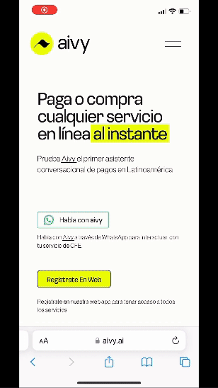
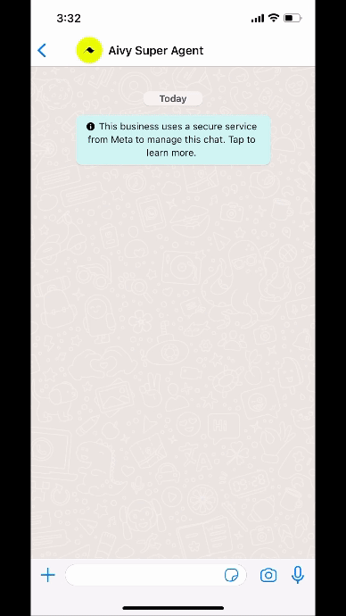

# Semantiks overview
<a href="https://www.semantiks.com/">Semantiks</a> is a funded pre-seed startup transforming Latin America's digital interactions with 
<a href="https://www.aivy.ai/">aivy</a> – a conversational AI application layer for the internet.

<b>Role:</b> Head of Product  
<b>Responsibilities</b>: Help the team learn from customers and the market as quickly as possible.

## Agent & Feature demos
### Entertainment agents
|  | Get show times and tickets for the latest movies Aivy’s Cinepolis and Cinemex (Mexico’s largest theater chains) agents give people the ability to check showtimes and buy tickets for the latest movies in theaters. These agents can also provide recommendations and insights about movies in general. Core features:Aggregation of showtime and movie dataMovie data query capabilities Advanced profiling and guardrails|
| --- | --- |
### Utility & Banking agents
|  | Chat with & take action on your bills and bank account. With real-time web-navigation capabilities, aivy can securely access your critical utility and bank accounts, allowing you to get balances, get reminders, and pay bills all through chat. We’ve built agents to support CFE (MX Electricity), AT&T (MX), and AMEX (MX). Core features: Live account authentication and data capture Email bill payment reminders Account data summarization |
| --- | --- |
### Voice note input
|  | Voice note input. Voice interaction is quickly becoming a preferred method of input, especially in LATAM. Aivy supports voice messages in a variety of languages, enabling people to have a quick and natural way to engage their agents. Core features: Voice recording support on WhatsappMulti-language input |
| --- | --- |
### Agent selection in Whatsapp
|  | Use all agents in one chat thread. With a layer abstracted over the collection of agents, users can access the features of all agents in a single Whatsapp chat. The separated nature of the agents allows for a focused interaction while the ability to switch contexts in the same chat enables users to get more done in one place. |
| --- | --- |
